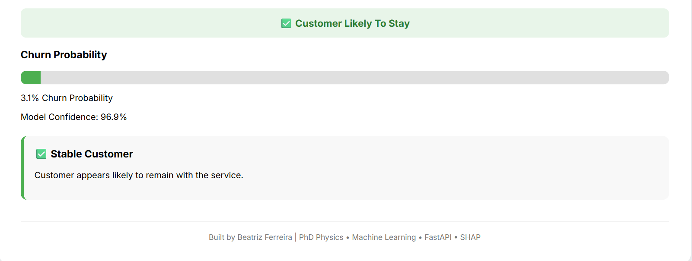
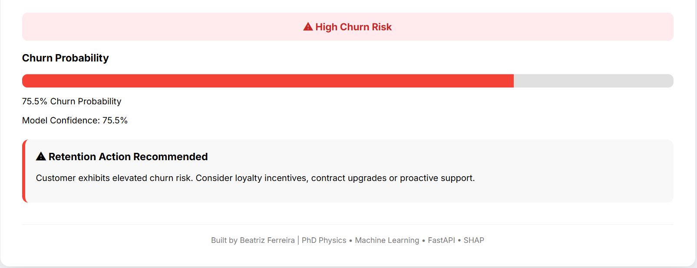
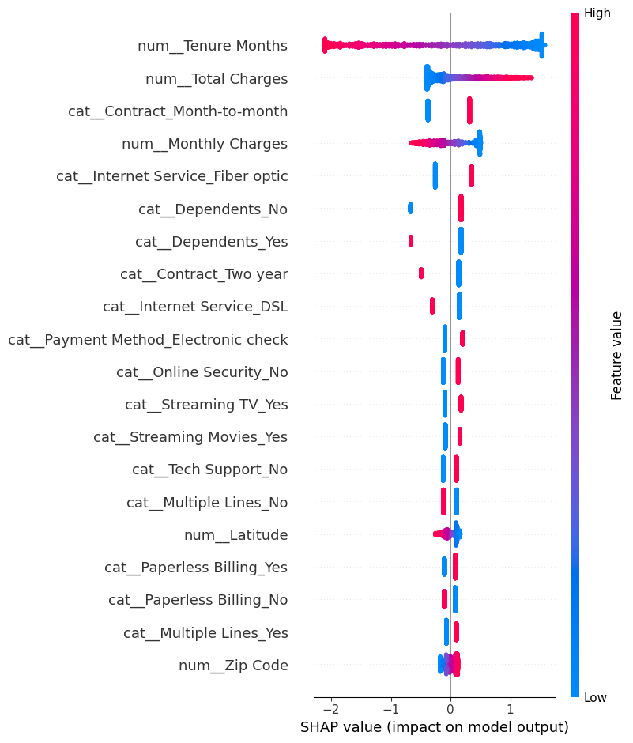

# Customer Churn Prediction

End-to-end Machine Learning application for predicting customer churn.

## Overview

This project predicts whether a customer is likely to churn using demographic and service subscription information.

The application includes:

- Exploratory Data Analysis (EDA)
- Data preprocessing pipeline
- Logistic Regression model
- SHAP explainability
- FastAPI backend
- Interactive HTML frontend

## Model Selection

Multiple machine learning algorithms were evaluated before deployment.

| Model | Accuracy | ROC-AUC |
|---------|---------|---------|
| Logistic Regression | 0.791 | 0.840 |
| XGBoost | 0.774 | 0.829 |

Logistic Regression achieved superior performance on the held-out test set and was selected as the final production model. In addition to achieving the highest ROC-AUC score, Logistic Regression offers excellent interpretability, making it well-suited for business decision-making and SHAP-based explainability.


## Features

- Gender
- Senior Citizen
- Partner
- Dependents
- Tenure Months
- Internet Service
- Contract Type
- Payment Method
- Monthly Charges


## Dashboard

### Low Churn Risk Example



Customer predicted to remain with the service.
Churn Probability: 3%

### High Churn Risk Example



Customer predicted to churn.
Churn Probability: 75%


## SHAP Feature Importance

Top predictors of churn:

1. Tenure Months
2. Month-to-Month Contract
3. Fiber Optic Service
4. Dependents
5. Monthly Charges



New Features
- Single customer churn prediction
- SHAP explainability
- Risk categorization
- Batch CSV predictions
- Downloadable prediction reports


## Tech Stack

- Python
- Pandas
- Scikit-Learn
- SHAP
- FastAPI
- HTML/CSS/JavaScript
- Git

## Run on Render
https://customer-churn-prediction-o6mm.onrender.com
```


## Future Improvements

- Real-time SHAP explanations inside the dashboard
- Enhanced business recommendations
- Prediction history tracking
- Interactive visual analytics
- Customer segmentation insights


## Author

Beatriz Ferreira

PhD Researcher in Condensed Matter Physics transitioning into Data Science and Machine Learning.