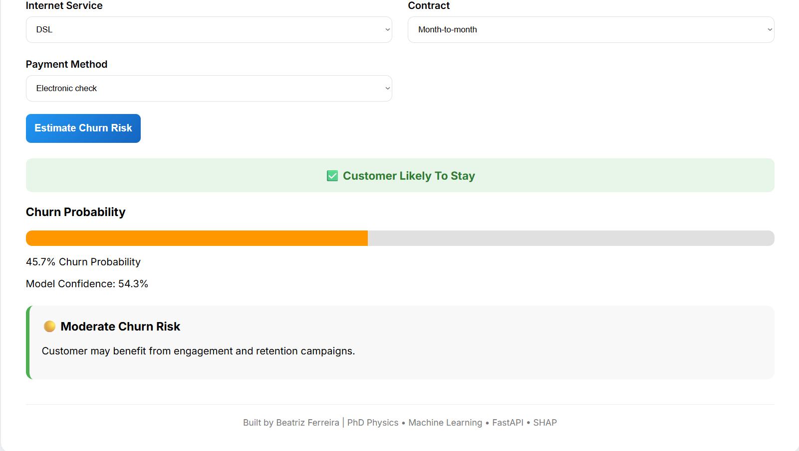

# Customer Churn Prediction

End-to-end Machine Learning application for predicting customer churn.

## Overview

This project predicts whether a customer is likely to churn using demographic and service subscription information.

The application includes:

- Exploratory Data Analysis (EDA)
- Data preprocessing pipeline
- Logistic Regression model
- SHAP explainability
- FastAPI backend
- Interactive HTML frontend

## Model Performance

| Metric | Value |
|----------|----------|
| Accuracy | 0.79 |
| ROC-AUC | 0.84 |

## Features

- Gender
- Senior Citizen
- Partner
- Dependents
- Tenure Months
- Internet Service
- Contract Type
- Payment Method
- Monthly Charges

## Dashboard



## SHAP Feature Importance

Top predictors of churn:

1. Tenure Months
2. Month-to-Month Contract
3. Fiber Optic Service
4. Dependents
5. Monthly Charges


## Tech Stack

- Python
- Pandas
- Scikit-Learn
- SHAP
- FastAPI
- HTML/CSS/JavaScript
- Git

## Run on Render
https://customer-churn-prediction-o6mm.onrender.com
```

## Author

Beatriz Ferreira

PhD Researcher in Condensed Matter Physics transitioning into Data Science and Machine Learning.