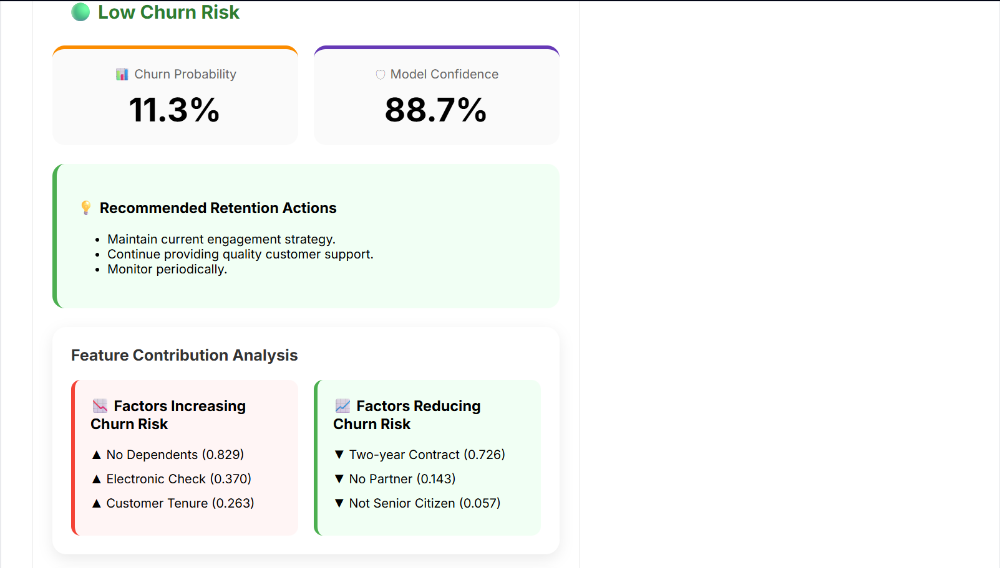
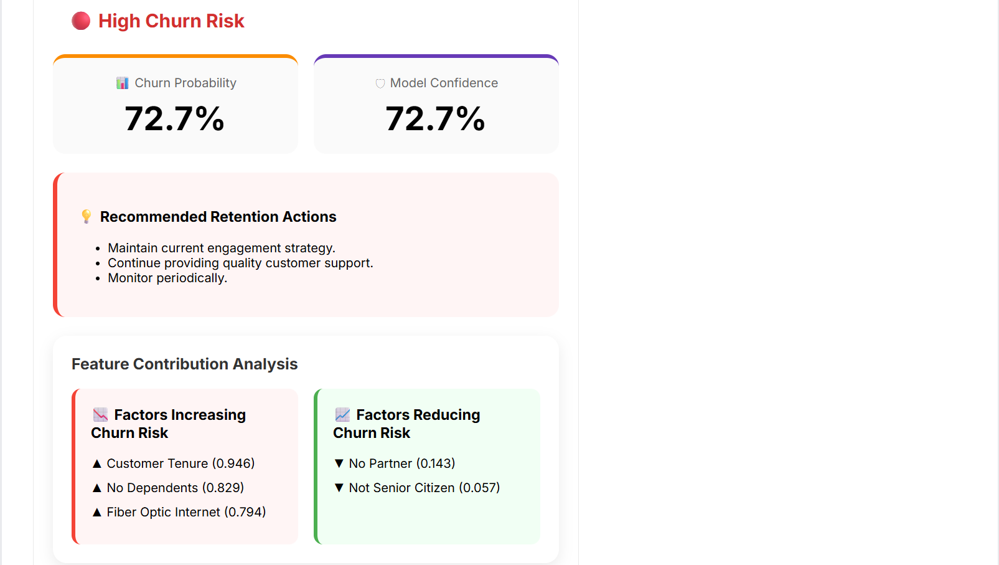
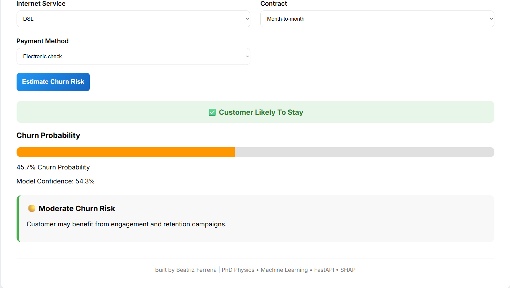
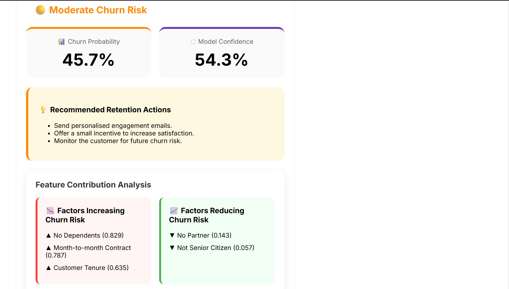
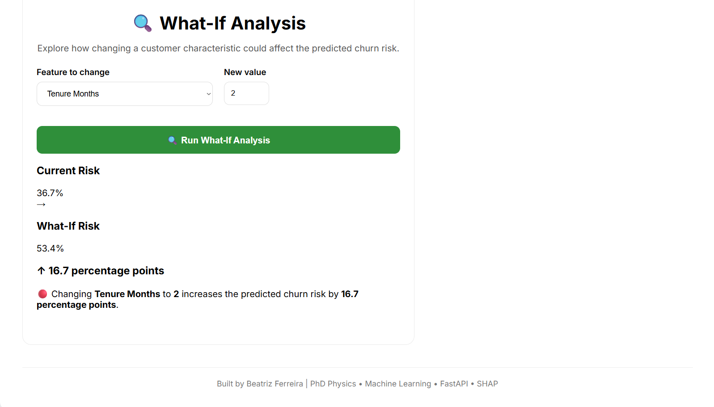
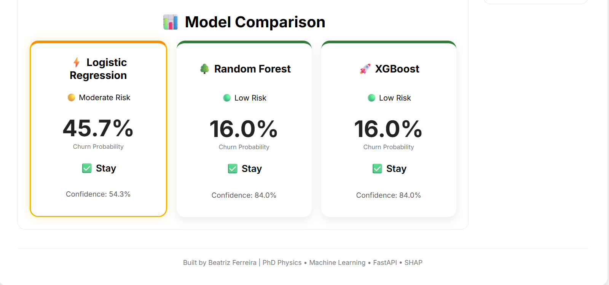

# 📊 Customer Churn Prediction

An end-to-end Machine Learning web application for predicting customer churn, comparing multiple classification models, explaining individual predictions with SHAP, performing batch predictions, and exploring What-If scenarios.

## Application Preview

<!-- Add main dashboard screenshot here -->

## Overview

This project is an end-to-end Machine Learning web application that predicts customer churn using demographic, subscription, and billing information.

The application combines trained Machine Learning models with an interactive FastAPI dashboard, allowing users to:

- Predict churn for individual customers
- Compare predictions from multiple Machine Learning models
- Upload CSV files for batch prediction
- Download prediction reports
- Visualize customer-specific SHAP explanations
- View prediction summaries and churn statistics
- Explore What-If scenarios by changing customer characteristics

## Model Selection

Three classification algorithms were evaluated using the same preprocessing pipeline and train/test split:

| Model | Accuracy | Precision | ROC-AUC | Training Time (s) |
|---|---:|---:|---:|---:|
| Logistic Regression | 0.791341 | 0.583569 | 0.841546 | 0.517 |
| XGBoost | 0.789212 | 0.615616 | 0.835357 | 1.147 |
| Random Forest | 0.763662 | 0.516691 | 0.817628 | 1.500 |

Logistic Regression achieved the highest accuracy and ROC-AUC while also requiring the shortest training time. Its relatively straightforward structure also makes it well suited for interpretation and SHAP-based explanations.

For these reasons, Logistic Regression was selected as the primary deployed model, while Random Forest and XGBoost are also available for comparison.

## Features

### Machine Learning

- Logistic Regression classifier
- Random Forest classifier
- XGBoost classifier
- Data preprocessing pipeline
- One-Hot Encoding
- Standard Scaling
- Probability estimation
- SHAP explainability

### Single Customer Prediction

Users can enter individual customer information and receive:

- Churn probability
- Churn risk category
- Model prediction
- Customer-specific recommendations
- SHAP feature contributions

### What-If Analysis

The What-If Analysis allows users to explore how changing individual customer characteristics affects the predicted churn probability.

Supported features include:

- Contract
- Internet Service
- Payment Method
- Gender
- Senior Citizen
- Partner
- Dependents
- Tenure Months
- Monthly Charges

The application compares the original prediction with the prediction after changing the selected feature.

For example:

> Changing Tenure Months from 24 to 2 increased the predicted churn probability from 45.7% to 53.4%.

This provides an interactive way to understand how the model responds to changes in customer characteristics.

### Batch Prediction

Users can upload a CSV file containing multiple customers to:

- Generate predictions for multiple customers
- Calculate churn probabilities
- Categorize churn risk
- Download the prediction results
- View a batch prediction summary

### Explainable AI

The application provides local SHAP explanations for individual predictions.

For each customer it displays:

- Factors increasing churn risk
- Factors reducing churn risk
- SHAP feature importance
- Feature contribution analysis

This allows users to understand *why* the model reached its prediction rather than only receiving a probability score.

## Dashboard

### Low Churn Risk Example



Customer predicted to remain with the service.

**Churn Probability: 3%**

### High Churn Risk Example



Customer predicted to churn.

**Churn Probability: 75%**

## Tech Stack

### Machine Learning

- Python
- Pandas
- NumPy
- Scikit-Learn
- XGBoost
- SHAP
- Joblib

### Backend

- FastAPI
- Uvicorn
- Jinja2

### Frontend

- HTML
- CSS
- JavaScript

### Deployment & Development

- Docker
- Git
- GitHub

## Live Demo

Try the application online:

https://customer-churn-prediction-o6mm.onrender.com

## Screenshots

### Main Dashboard



### Single Customer Prediction



### SHAP Explanation


### Batch CSV Prediction


### What-If Analysis



### Compare Models 



## Project Structure

```text
customer-churn-prediction/
├── data/
│   └── Telco_customer_churn.xlsx
│
├── notebooks/
│   ├── 01_eda.ipynb
│   ├── 02_preprocessing.ipynb
│   └── 03_customer_churn_models.ipynb
│
├── screenshots/
│   ├── dashboard.png
│   ├── dashboard1.png
│   ├── dashboard2.png
│   ├── main_dashboard.png
│   ├── single_customer.png
│   ├── batch.png
│   ├── shap1.png
│   ├── shap2.png
│   └── shap_exp.png
│
├── src/
│   ├── churn_model.pkl
│   ├── logistic_model.pkl
│   ├── random_forest_model.pkl
│   ├── xgboost_model.pkl
│   └── feature_names.pkl
│
├── templates/
│   └── index.html
│
├── main.py
├── requirements.txt
├── Dockerfile
├── .dockerignore
└── README.md
```

## Installation

### Clone the Repository

```bash
git clone https://github.com/BeatrizFerreira96/customer-churn-prediction.git
cd customer-churn-prediction
```

### Install Dependencies
pip install -r requirements.txt

## Run the Application Locally
uvicorn main:app --reload
Open:
http://127.0.0.1:8000

## Docker
The application can also be built and run using Docker.

### Build the Docker Image
docker build -t customer-churn-prediction .

### Run the Container
docker run -d \
  --name churn-app \
  -p 8000:8000 \
  customer-churn-prediction

The application will then be available at:

http://localhost:8000

## Current Capabilities

Single customer churn prediction
Multiple Machine Learning models
Model comparison
Batch CSV prediction
Prediction summary
Downloadable prediction reports
SHAP explanations
Feature contribution analysis
Customer-specific recommendations
What-If analysis
Numerical What-If analysis for tenure and monthly charges
Categorical What-If analysis
CSV validation
FastAPI backend
Docker containerization
Future Improvements
Add user authentication
Store prediction history in a database
Automated model retraining
Model performance monitoring
Prediction history and analytics
Additional model explainability features

## License

This project is licensed under the MIT License.

## Author

Beatriz Ferreira

PhD in Condensed Matter Physics transitioning into Machine Learning and Data Science.

GitHub: https://github.com/BeatrizFerreira96