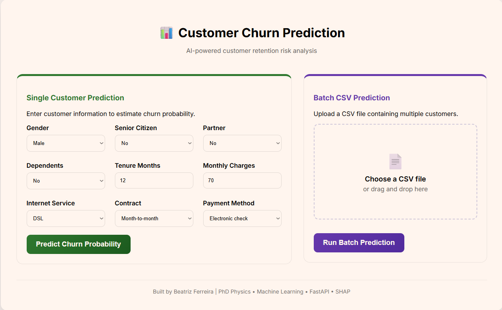
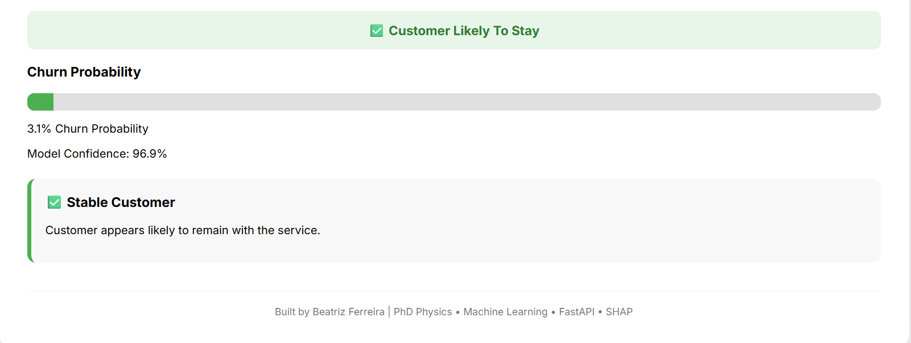
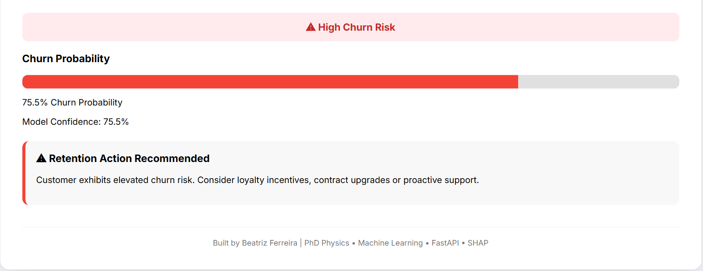
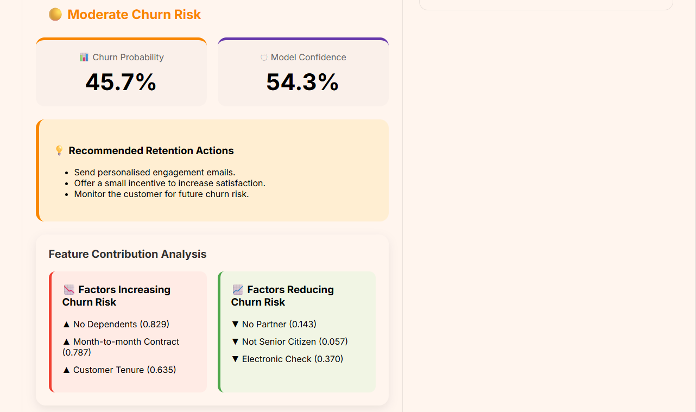
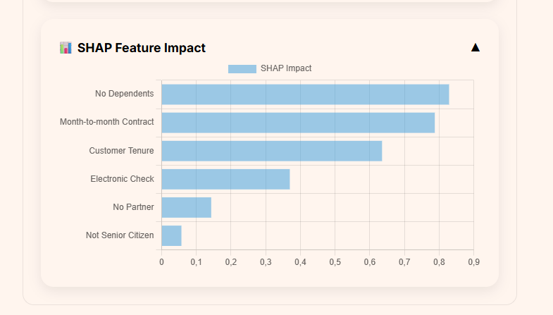
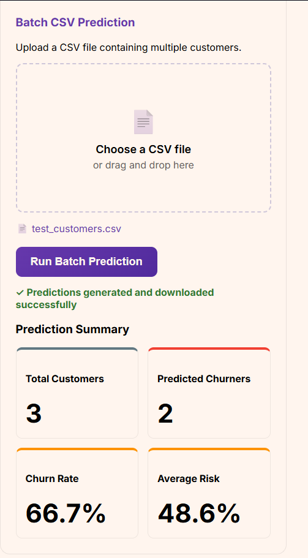

# 📊 Customer Churn Prediction


## Application Preview




## Overview

This project is an end-to-end Machine Learning web application that predicts customer churn using demographic and subscription information.

The application combines a trained Logistic Regression model with an interactive FastAPI dashboard, allowing users to:

- Predict churn for individual customers
- Upload CSV files for batch prediction
- Download prediction reports
- Visualize customer-specific SHAP explanations
- View prediction summaries and churn statistics

## Model Selection

Multiple machine learning algorithms were evaluated before deployment.

	Model	Accuracy	Precision	ROC-AUC	Training Time (s)
0	Logistic Regression	0.791341	0.583569	0.841546	0.517
2	XGBoost	0.789212	0.615616	0.835357	1.147
1	Random Forest	0.763662	0.516691	0.817628	1.500


Three classification algorithms (Logistic Regression, Random Forest, and XGBoost) were evaluated using the same preprocessing pipeline and train/test split. Logistic Regression achieved the highest performance across all evaluation metrics while also requiring the shortest training time and providing the greatest interpretability. These characteristics made it the preferred model for deployment and SHAP-based explainability.

## Features

### Machine Learning

- Logistic Regression classifier
- Data preprocessing pipeline
- One-Hot Encoding
- Standard Scaling
- Probability estimation
- SHAP explainability

### Web Application

- Single customer prediction
- Batch CSV prediction
- Downloadable prediction reports
- Prediction summary dashboard
- Customer-specific SHAP explanations
- Feature contribution analysis
- Input validation
- Friendly error handling

## Dashboard

### Low Churn Risk Example



Customer predicted to remain with the service.
Churn Probability: 3%

### High Churn Risk Example



Customer predicted to churn.
Churn Probability: 75%


## Explainable AI

The application provides local SHAP explanations for every prediction.

For each customer it displays:

- Factors increasing churn risk
- Factors reducing churn risk
- SHAP feature importance chart

This allows users to understand *why* the model reached its prediction rather than only receiving a probability score.


## Tech Stack

- Python
- Pandas
- Scikit-Learn
- SHAP
- FastAPI
- HTML/CSS/JavaScript
- Git

## Live Demo

Try the application online:

https://customer-churn-prediction-o6mm.onrender.com
``

## Screenshots

### Single Customer Prediction



### SHAP Explanation



### Batch CSV Prediction




## Project Structure

```text
customer-churn-prediction
├── data/
├── notebooks/
├── screenshots/
├── src/
│   ├── churn_model.pkl
│   ├── feature_names.pkl
│   └── model_training.py
├── templates/
│   └── index.html
├── main.py
├── requirements.txt
└── README.md
```

## Installation

Clone the repository

```bash
git clone https://github.com/BeatrizFerreira96/customer-churn-prediction.git
```

Install dependencies

```bash
pip install -r requirements.txt
```

Run the application

```bash
uvicorn main:app --reload
```

Open

```
http://127.0.0.1:8000
```

## Current Capabilities

- Single customer prediction
- Batch CSV prediction
- Prediction summary
- Downloadable prediction reports
- SHAP explanations
- Feature contribution analysis
- Customer-specific recommendations
- Robust CSV validation

## Future Improvements


- Deploy with Docker
- Add user authentication
- Store prediction history in a database
- Support additional machine learning models
- Automated model retraining
- Interactive analytics dashboard


## License

This project is licensed under the MIT License.


## Author
**Beatriz Ferreira**

PhD in Condensed Matter Physics transitioning into Machine Learning and Data Science.

- GitHub: github.com/BeatrizFerreira96